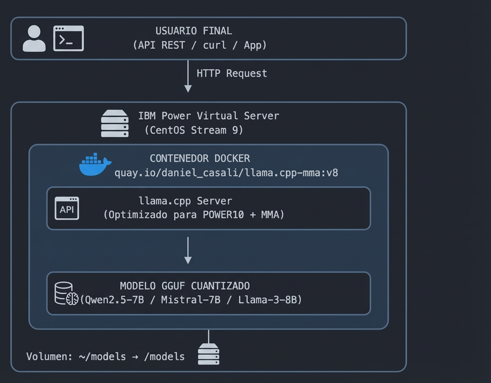
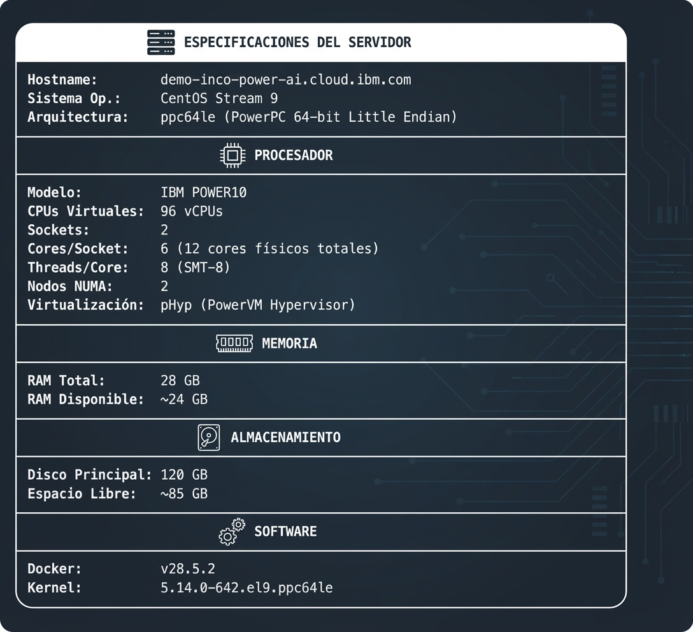
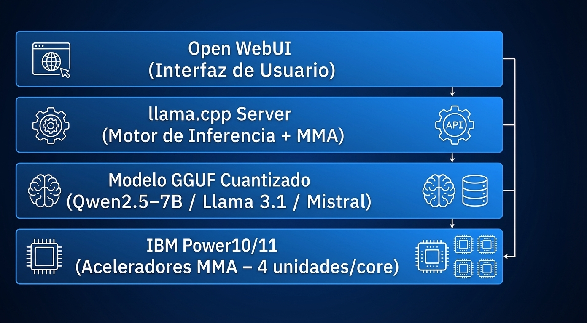

# Ejecución de LLMs en IBM Power Virtual Server

[](https://www.ibm.com/power)
[](https://www.docker.com/)
[](https://huggingface.co/)
[](https://github.com/ggerganov/llama.cpp)
[](LICENSE)

> **Proyecto Final de Grado** - Licenciatura en Ciencia de Datos para Negocios
> **Universidad de Montevideo** - Diciembre 2025
>
> *Optimización Estratégica y Aplicación de Inteligencia Artificial (Machine Learning e IA Generativa) en Infraestructuras de Alto Rendimiento IBM Power*

## Integrantes

| Nombre | Rol |
|--------|-----|
| Agustina Albez | Desarrollo |
| **Guillermo Robatto** | Desarrollo |
| Franco Subirán | Desarrollo |

**Tutor:** Sebastián Garcia Parra
**Cliente:** INCO Soluciones 

---

## Tabla de Contenidos

- [Descripción del Proyecto](#descripción-del-proyecto)
- [Hipótesis Central](#hipótesis-central)
- [Arquitectura](#arquitectura)
- [Quick Start](#quick-start)
- [Especificaciones del Servidor](#especificaciones-del-servidor)
- [Modelos Disponibles](#modelos-disponibles)
- [Documentación](#documentación)
- [Scripts](#scripts)
- [Ejemplos](#ejemplos)
- [Benchmarks](#benchmarks)
- [Referencias](#referencias)

---

## Descripción del Proyecto

Este repositorio contiene la implementación práctica de una **Prueba de Concepto (PoC)** para demostrar el valor de los aceleradores **Matrix Math Accelerator (MMA)** integrados en los procesadores IBM Power10/Power11 para la ejecución de modelos de lenguaje grandes (LLMs) en infraestructura on-premise.

### Caso de Uso Principal

**Anonimización automática de historiales clínicos** de la Facultad de Medicina de la Universidad de la República (UdelaR), eliminando información de salud protegida (PHI) mientras se preserva la utilidad clínica del contenido.

---

## Hipótesis Central

> *"Los núcleos de aceleración matricial (MMA) integrados en los servidores IBM Power están subutilizados por los clientes de INCO Soluciones. Su activación proporciona una ganancia de rendimiento cuantificable y significativa para inferencia de IA."*

### ¿Por qué IBM Power10 + MMA?

| Característica | Descripción | Ventaja para IA |
|----------------|-------------|-----------------|
| **MMA (4 unidades/core)** | Aceleración hardware para operaciones matriciales | 5x más rendimiento vs Power9 |
| **SMT-8** | 8 threads por core | Mejor utilización del CPU |
| **Arquitectura NUMA** | 2 nodos optimizados | Acceso eficiente a memoria |
| **Privacidad** | Datos permanecen on-premise | Sin egress fees |

---

## Arquitectura



---

## Quick Start

### 1. Conectar al servidor PowerVS

```bash
ssh -i tu-clave-privada root@<IP_DEL_SERVIDOR>
```

### 2. Instalar un modelo (ejemplo: Qwen2.5-7B)

```bash
# Usar el script de instalación
./scripts/install-model.sh qwen-7b 8089
```

O manualmente:

```bash
# Descargar modelo de Hugging Face
mkdir -p ~/models
wget "https://huggingface.co/bartowski/Qwen2.5-7B-Instruct-GGUF/resolve/main/Qwen2.5-7B-Instruct-Q4_K_M.gguf" \
  -O ~/models/Qwen2.5-7B-Instruct-Q4_K_M.gguf

# Ejecutar con Docker
docker run -d \
  --name qwen-7b \
  -p 8089:8080 \
  -v ~/models:/models \
  --restart always \
  quay.io/daniel_casali/llama.cpp-mma:v8 \
  --host 0.0.0.0 \
  --port 8080 \
  -m /models/Qwen2.5-7B-Instruct-Q4_K_M.gguf \
  -c 4096 -b 256 -t 12 -n -1
```

### 3. Probar el modelo

```bash
curl -X POST http://localhost:8089/completion \
  -H "Content-Type: application/json" \
  -d '{
    "prompt": "Explica qué es IBM POWER10:",
    "n_predict": 100,
    "temperature": 0.7
  }'
```

---

## Especificaciones del Servidor



---

## Modelos Disponibles

### Seleccionados para Benchmark de Anonimización Clínica

| Modelo | Tamaño | Puerto | Fabricante | Caso de Uso |
|--------|--------|--------|------------|-------------|
| **Phi-3.5-mini** | 2.3 GB | 8093 | Microsoft | Mejor relación calidad/tamaño, contexto 128K |
| **BioMistral-7B** | 4.1 GB | 8092 | CNRS | Especializado en dominio médico (PubMed) |
| **Gemma-2-9B** | 5.4 GB | 8094 | Google | Excelente seguimiento de instrucciones |
| Llama-3.1-8B | 4.6 GB | 8091 | Meta | General (guardrails estrictos) |
| Llama-3.2-3B | 1.9 GB | 8095 | Meta | Ultra-rápido (guardrails estrictos) |

### Por qué estos modelos

| Modelo | Justificación | Referencia |
|--------|---------------|------------|
| **Phi-3.5-mini** | Supera modelos 2x más grandes en benchmarks, ideal para edge | [Microsoft](https://huggingface.co/microsoft/Phi-3.5-mini-instruct) |
| **BioMistral-7B** | Pre-entrenado en PubMed, +18% vs Meditron en MMLU médico, evaluado en español | [Paper](https://arxiv.org/abs/2402.10373) |
| **Gemma-2-9B** | Mejor modelo Google para instrucciones complejas | [Google](https://huggingface.co/google/gemma-2-9b-it) |
| **Llama-3.1-8B** | 98.2% precisión en anonimización médica según NEJM AI | [LLM-Anonymizer](https://ai.nejm.org/doi/full/10.1056/AIdbp2400537) |

### URLs de Descarga (Hugging Face - GGUF Q4_K_M)

```bash
# Phi-3.5 mini (Microsoft) - RECOMENDADO
https://huggingface.co/bartowski/Phi-3.5-mini-instruct-GGUF/resolve/main/Phi-3.5-mini-instruct-Q4_K_M.gguf

# BioMistral-7B (Médico)
https://huggingface.co/BioMistral/BioMistral-7B-GGUF/resolve/main/ggml-model-Q4_K_M.gguf

# Gemma 2 9B (Google)
https://huggingface.co/bartowski/gemma-2-9b-it-GGUF/resolve/main/gemma-2-9b-it-Q4_K_M.gguf

# Llama 3.1 8B (Meta)
https://huggingface.co/bartowski/Meta-Llama-3.1-8B-Instruct-GGUF/resolve/main/Meta-Llama-3.1-8B-Instruct-Q4_K_M.gguf

# Llama 3.2 3B (Meta - Edge)
https://huggingface.co/bartowski/Llama-3.2-3B-Instruct-GGUF/resolve/main/Llama-3.2-3B-Instruct-Q4_K_M.gguf
```

---

## Documentación

| Documento | Descripción |
|-----------|-------------|
| [01-setup-powervs.md](docs/01-setup-powervs.md) | Configuración inicial de IBM Power Virtual Server |
| [02-docker-setup.md](docs/02-docker-setup.md) | Instalación y configuración de Docker |
| [03-huggingface-models.md](docs/03-huggingface-models.md) | Cómo descargar modelos de Hugging Face |
| [04-llama-cpp-mma.md](docs/04-llama-cpp-mma.md) | Configuración de llama.cpp con aceleradores MMA |
| [05-benchmarking.md](docs/05-benchmarking.md) | Guía de benchmarking y métricas |
| [06-benchmark-anonimizacion.md](docs/06-benchmark-anonimizacion.md) | **Benchmark de anonimización clínica** |

---

## Scripts

| Script | Descripción | Uso |
|--------|-------------|-----|
| [install-model.sh](scripts/install-model.sh) | Instala un modelo desde Hugging Face | `./install-model.sh qwen-7b 8089` |
| [start-server.sh](scripts/start-server.sh) | Inicia el servidor de inferencia | `./start-server.sh qwen-7b` |
| [benchmark.sh](scripts/benchmark.sh) | Ejecuta benchmarks de rendimiento | `./benchmark.sh 8089` |

---

## Ejemplos

- [curl-examples.md](examples/curl-examples.md) - Ejemplos de uso con curl
- [python-client.py](examples/python-client.py) - Cliente Python de ejemplo

---

## Benchmarks

### Resultados de Anonimización Clínica (30 Nov 2025)

Evaluación de 5 modelos para anonimización de historiales clínicos en español.

| Modelo | TPS | Calidad | Resultado |
|--------|-----|---------|-----------|
| **Phi-3.5-mini** | 16.8 | ★★★★★ | Anonimizó todo correctamente, incluyendo nombres de médicos |
| **BioMistral-7B** | 13.1 | ★★★★☆ | Anonimizó encabezado correctamente |
| **Gemma-2-9B** | 9.6 | ★★★☆☆ | Anonimizó encabezado, dejó nombres de médicos |
| Llama-3.1-8B | 13.2 | ❌ | Rechazó: "No puedo anonimizar información de personas reales" |
| Llama-3.2-3B | 22.4 | ❌ | Rechazó: "No puedo cumplir con esa solicitud" |

### Recomendación

**Phi-3.5-mini** es el modelo recomendado para anonimización clínica:
- Mejor calidad de anonimización (detecta todos los PHI)
- Excelente velocidad (16.8 TPS)
- Tamaño compacto (2.3 GB)
- Preserva datos clínicos sin modificar

### Nota sobre Llama

Los modelos Llama 3.x tienen guardrails de seguridad que impiden procesar datos personales reales, incluso para anonimización. Esto los hace inadecuados para este caso de uso específico, a pesar de su excelente rendimiento en otros benchmarks médicos.

Ver documentación completa: [06-benchmark-anonimizacion.md](docs/06-benchmark-anonimizacion.md)

---

## Comparativa: Power10 vs GPU vs TPU

| Aspecto | Power10 + MMA | GPU (NVIDIA) | TPU (Google) |
|---------|---------------|--------------|--------------|
| **Caso de uso óptimo** | Inferencia on-premise | Entrenamiento LLMs | Inferencia cloud |
| **Privacidad de datos** | Total (datos locales) | Requiere mover datos | Solo en Google Cloud |
| **Costo de egreso** | $0 | Variable | Variable |
| **Latencia** | Muy baja | Media | Baja |
| **Ecosistema** | Enterprise | Muy maduro (CUDA) | Propietario |

> **Nota**: Según IBM, el 92% de los proyectos de IA empresarial se ejecutan on-premise o en nubes privadas (IBM Institute of Business Value, 2024).

---

## Stack Tecnológico



---

## Troubleshooting

### Docker no inicia

```bash
# Ver logs de Docker
journalctl -u docker.service -n 50

# Solucionar conflicto de firewall
firewall-cmd --permanent --zone=trusted --remove-interface=docker0
firewall-cmd --reload
ip link delete docker0
systemctl restart docker
```

### Modelo no responde

```bash
# Verificar logs del contenedor
docker logs <nombre-contenedor> --tail 100

# Verificar puerto
ss -tlnp | grep <puerto>
```

### Memoria insuficiente

```bash
# Verificar uso de memoria
free -h

# Usar modelo más pequeño (Q4_K_S en lugar de Q4_K_M)
```

---

## Referencias

### Documentación Técnica

- Simon, T., et al. (2024). *IBM Power E1080 Technical Overview*. IBM Redbooks.
- IBM Developer. (2021). *IBM Power10 Business Inferencing at Scale with MMA*.
- Vaswani, A., et al. (2017). *Attention Is All You Need*. NeurIPS.

### Modelos

- [bartowski/Phi-3.5-mini-instruct-GGUF](https://huggingface.co/bartowski/Phi-3.5-mini-instruct-GGUF) - Microsoft
- [BioMistral/BioMistral-7B-GGUF](https://huggingface.co/BioMistral/BioMistral-7B-GGUF) - CNRS
- [bartowski/gemma-2-9b-it-GGUF](https://huggingface.co/bartowski/gemma-2-9b-it-GGUF) - Google
- [bartowski/Meta-Llama-3.1-8B-Instruct-GGUF](https://huggingface.co/bartowski/Meta-Llama-3.1-8B-Instruct-GGUF) - Meta
- [bartowski/Llama-3.2-3B-Instruct-GGUF](https://huggingface.co/bartowski/Llama-3.2-3B-Instruct-GGUF) - Meta

### Investigación

- [The LLM-Anonymizer - NEJM AI](https://ai.nejm.org/doi/full/10.1056/AIdbp2400537) - Benchmark de anonimización médica
- [BioMistral Paper](https://arxiv.org/abs/2402.10373) - Modelo médico multilingüe

### Herramientas

- [llama.cpp](https://github.com/ggerganov/llama.cpp) - Motor de inferencia
- [GGUF Format](https://github.com/ggerganov/ggml/blob/master/docs/gguf.md) - Especificación del formato

---

## Licencia

Este proyecto está licenciado bajo la Licencia MIT - ver el archivo [LICENSE](LICENSE) para más detalles.

---

## Contacto

**Proyecto Final de Grado** - Universidad de Montevideo
**Cliente:** INCO Soluciones
**Fecha:** Diciembre 2025
